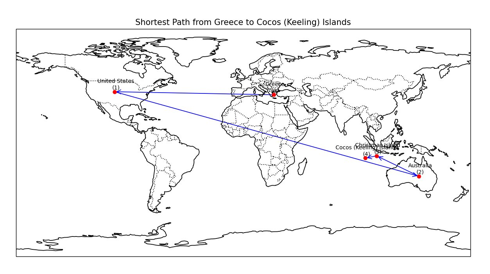

# Airlines Reachability

Analyze airline reachability using Open Flights data: country-level and airport-level graphs, centrality metrics, shortest paths, and map visualizations.

## Centrality & Closeness

The code computes **degree centrality** and **closeness centrality** on the country graph:

- **Degree centrality**: how many direct flight connections a country has. High degree = many direct routes.
- **Closeness centrality**: average inverse distance to all other countries via shortest paths. High closeness = fewer hops to reach the rest of the network.

These metrics identify the most and least accessible countries by air.

## Shortest Path & Map Visualization

Shortest paths are computed with NetworkX (BFS) on the country graph and airport graph. The path minimizes the number of hops (connections), not geographic distance—so a route may cross continents in non-intuitive ways.

Example: Greece → Cocos (Keeling) Islands:



The path goes Greece → United States → Australia → Christmas Island → Cocos (Keeling) Islands (4 hops), reflecting how airline routes are structured rather than geographic proximity.

## Setup

```bash
pip install -r requirements.txt
```

## Data

1. **Download** (requires [Kaggle API](https://github.com/Kaggle/kaggle-api) configured):

   ```bash
   python scripts/download_data.py
   ```

2. Or place `routes.csv`, `airlines.dat`, `airports.dat` in `data/` (or `open_flights_data/`).

---

**Summary:** Open Flights data → country/airport graphs → degree & closeness centrality → shortest-path analysis → world-map visualizations.
